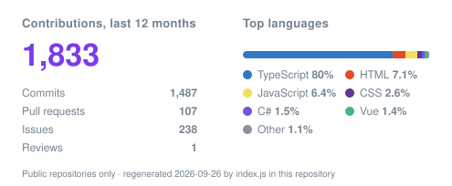

<h1 align="center">Brandon Perfetti</h1>

AI-augmented software and product engineer · agent pipelines run under a written harness · the Next.js and TypeScript products they ship

I lead the frontend of a multi-tenant real-estate platform: Next.js and TypeScript sites on one shared component package, each with its own headless CMS. Most of that work is delivered through AI agents running under a written harness. The agents write code; the deciding happens first, and it happens on paper.

## How I work

Five stages. The first four are specification; only the fifth is code.

1. **Grill the problem.** What is actually being asked for, what is assumed, what happens if we do nothing. Most of what I cut gets cut here, when cutting is free.
2. **Write the master priority document.** One file a cold reader can pick up and run the next wave from.
3. **Cut tickets.** The finding in the title, the receipts in the body.
4. **Set the fence.** Which files each agent lane owns, and which shared manifests have to be serialised rather than parallelised.
5. **Dispatch waves, then review every one.** Nothing lands without a review pass.

Four invariants keep it safe:

- **Two-axis review before acceptance.** Every change is checked against the repo's documented standards and against what the ticket asked for.
- **A capability guard decides autonomy.** Attended or autonomous is a measured decision against five checks, not a mood.
- **Evidence labels.** Every claim is marked as measured, read from source, or inferred, and the three are kept apart.
- **Agents never merge.** A human sits at the irreversible boundary.

The full write-up, including an audit of how I direct agents by one of my own agents, is at [brandonperfetti.com/how-i-work](https://brandonperfetti.com/how-i-work). The agreements themselves are public: [agent-working-agreements](https://github.com/brandonperfetti/agent-working-agreements).

## What it produced

One program is the clearest illustration: a fleet-hardening initiative around incremental static regeneration. Roughly 150 tickets and 426 files across a shared component package, the CMS, the portal and the tenant sites, first commit to fleet promotion in four weeks, in ten reviewed waves, with the fleet end-to-end suite green at every wave.

The number I care about there is not 426. It is ten: the number of times the work stopped and got looked at before any of it reached a release branch.

**Before that,** a decade of data integrations built the depth: helping build a React and GraphQL ingestion platform for 250+ MLS feeds and 10M+ records, SAML/JWT SSO across 100+ platforms, and a re-architecture that cut data-source integration time by 80%.

## Featured work

<table>
<tr>
<td valign="top" width="50%">

### [Agent Working Agreements](https://github.com/brandonperfetti/agent-working-agreements)

The harness itself: evidence labels, the two modes and the guard that picks between them, the git ritual, the stop-list. The changelog shows which rules changed after something bit.

`Markdown` `Shell` `GitHub Actions`

</td>
<td valign="top" width="50%">

### [GitHub commit dashboard](https://github.brandonperfetti.com)

14 charts on PR throughput, cycle time, flow health and release cadence, read server-side from the GitHub API. Nobody asked me to build it. [Source](https://github.com/brandonperfetti/github-commit-dashboard).

`Next.js 16` `React 19` `Recharts` `Tailwind v4` `Vitest`

</td>
</tr>
<tr>
<td valign="top" width="50%">

### [brandonperfetti.com, the source](https://github.com/brandonperfetti/bp-portfolio)

The site and its content platform: a block page-builder on Payload CMS, Storybook for the components, Vitest and Playwright in CI.

`Next.js 16` `Payload CMS` `Supabase` `Clerk` `Storybook`

</td>
<td valign="top" width="50%">

### [macOS Portfolio](https://macos.brandonperfetti.com)

An interactive macOS-inspired portfolio: windows, a dock, a menu bar. What frontend craft looks like when the constraints are removed.

`React` `TypeScript` `GSAP` `Zustand` `Tailwind CSS`

</td>
</tr>
<tr>
<td valign="top" width="50%">

### [Top Timelines](https://toptimelines.com)

Event timelines made simple for teams and organizations. A SaaS product built around clear information architecture and fast, intuitive UX.

`Next.js` `TypeScript` `Tailwind CSS` `Prisma` `PostgreSQL`

</td>
<td valign="top" width="50%">

### [EMP Consultants](https://empconsultants.com)

A modernized web presence for a forensic engineering firm. Accessibility-first, CMS-driven, and built for long-term maintainability.

`Next.js` `TypeScript` `Tailwind CSS` `Headless CMS`

</td>
</tr>
</table>

## Latest articles

- [Four-Week Context Reset: Recover Focus After an Interrupt-Heavy Sprint](https://brandonperfetti.com/articles/four-week-context-reset) · Sep 2026
- [Your Runbook Is Rotting. Teach It to an Agent Instead.](https://brandonperfetti.com/articles/runbooks-to-agent-skills) · Aug 2026
- [The Cheapest Database Migration Is the One You Do Before Production Exists](https://brandonperfetti.com/articles/from-neon-to-supabase) · Aug 2026

More at [brandonperfetti.com/articles](https://brandonperfetti.com/articles).

## Tech stack

**Core**

**AI-augmented engineering**

**UI**

**Backend and data**

**Testing**

**Delivery**

## Certifications

22 certificates in three groups (click to expand)

#### AI and agentic engineering

| Certificate | Issuer | Issued |
| --- | --- | --- |
| [AI Coding Crash Course](https://res.cloudinary.com/dgwdyrmsn/image/upload/v1790404889/bp-portfolio/certificates/certificate-ai-coding-crash-course_ng2utj.png) | AIHero.dev | Sep 2026 |
| [AI Coding for Real Engineers](https://res.cloudinary.com/dgwdyrmsn/image/upload/v1790404903/bp-portfolio/certificates/certificate-ai-coding-for-real-engineers-m0k0w_vl68nz.png) | AIHero.dev | Jun 2026 |
| [Claude Code for Real Engineers](https://res.cloudinary.com/dgwdyrmsn/image/upload/v1775751727/bp-portfolio/certificates/certificate-claude-code-for-real-engineers-2026-04_ckhivl.png) | AIHero.dev | Apr 2026 |
| [AI SDK v6 Crash Course](https://res.cloudinary.com/dgwdyrmsn/image/upload/v1773507613/bp-portfolio/certificates/certificate-ai-sdk-v6-crash-course_qvdane.png) | AIHero.dev | Mar 2026 |
| [Build Your Own AI Personal Assistant in TypeScript](https://res.cloudinary.com/dgwdyrmsn/image/upload/v1767218650/bp-portfolio/certificates/certificate-build-your-own-ai-personal-assistant-in-typescript_xeycuc.png) | AIHero.dev | Dec 2025 |
| [Master the Model Context Protocol (MCP)](https://res.cloudinary.com/epic-web/image/upload/v1762115259/certificate/8414cfa5-7b49-4e55-a96a-086fa37d18a2/master-mcp.png) | EpicAI.pro | Nov 2025 |

#### Frontend and full-stack depth

| Certificate | Issuer | Issued |
| --- | --- | --- |
| [Certificate of Interface Design](https://res.cloudinary.com/dgwdyrmsn/image/upload/q_auto/f_auto/v1775751920/bp-portfolio/certificates/Shift_Nudge_Certificate_of_Completion_LIGHT_qguasq.jpg) | Shift Nudge | Apr 2026 |
| [The Complete Next.js Testing Course](https://res.cloudinary.com/dgwdyrmsn/image/upload/v1771693734/bp-portfolio/certificates/next_js_testing_course_fbv4hr.png) | JS Mastery | Feb 2026 |
| [Database Mastery: SQL to Prisma](https://res.cloudinary.com/dgwdyrmsn/image/upload/v1771694012/bp-portfolio/certificates/database_mastery__sql_to_prisma_pzizqg.png) | JS Mastery | Jan 2026 |
| [Full Stack Foundations](https://www.epicweb.dev/api/certificate?moduleId=deb1eeaf-7f3a-4dff-81a1-9f07826693c2&userId=6c5131b7-848a-48f8-832d-db5c3b42b00a) | Epic Web | Jul 2024 |
| [Professional Web Forms](https://www.epicweb.dev/api/certificate?moduleId=9abe3ebc-46e9-4b9e-a7b0-347c83f83941&userId=6c5131b7-848a-48f8-832d-db5c3b42b00a) | Epic Web | Jul 2024 |
| [Data Modeling Deep Dive](https://www.epicweb.dev/api/certificate?moduleId=f3e2f5a3-0b46-4a56-bbfe-20803d1150d7&userId=6c5131b7-848a-48f8-832d-db5c3b42b00a) | Epic Web | Jul 2024 |
| [Authentication Strategies & Implementation](https://www.epicweb.dev/api/certificate?moduleId=6232cc37-2516-4e5c-933a-00d3382df4db&userId=6c5131b7-848a-48f8-832d-db5c3b42b00a) | Epic Web | Jul 2024 |
| [Pixel Perfect Figma to Tailwind](https://www.epicweb.dev/api/certificate?moduleId=adfc5b24-b4c4-47f1-8793-f20e9eff6104&userId=6c5131b7-848a-48f8-832d-db5c3b42b00a) | Epic Web | Jul 2024 |

#### Quality and accessibility

| Certificate | Issuer | Issued |
| --- | --- | --- |
| [Web Application Testing](https://www.epicweb.dev/api/certificate?moduleId=9ef184d7-f6a9-4cf0-8ab7-ee6724492fbf&userId=6c5131b7-848a-48f8-832d-db5c3b42b00a) | Epic Web | Jul 2024 |
| [Testing Fundamentals](https://www.epicweb.dev/api/certificate?moduleId=eccd4ac1-5d10-4249-b71c-193016738bff&userId=6c5131b7-848a-48f8-832d-db5c3b42b00a) | Epic Web | Jul 2024 |
| [Automated Accessibility Testing](https://res.cloudinary.com/dgwdyrmsn/image/upload/v1721666251/bp-portfolio/certificates/automated_accessibility_testing_certificate_raqncm.png) | testingaccessibility.com | Jul 2024 |
| [Coding Accessible Interactions and Mechanics](https://res.cloudinary.com/dgwdyrmsn/image/upload/v1721593308/bp-portfolio/certificates/coding_accessible_interactions_and_mechanics_certificate_wzsxnq.png) | testingaccessibility.com | Jul 2024 |
| [Semantic Markup with HTML and ARIA](https://res.cloudinary.com/dgwdyrmsn/image/upload/v1720464148/bp-portfolio/certificates/semantic_markup_with_html_and_aria_certificate_wyv5kd.png) | testingaccessibility.com | Jul 2024 |
| [Manual Accessibility Testing](https://res.cloudinary.com/dgwdyrmsn/image/upload/v1720392568/bp-portfolio/certificates/manual_accessibility_testing_certificate_syvdha.png) | testingaccessibility.com | Jul 2024 |
| [Design Thinking & People Skills for Accessibility](https://res.cloudinary.com/dgwdyrmsn/image/upload/v1720111969/bp-portfolio/certificates/design_thinking_and_people_skills_for_accessibility_certificate_abp4v5.png) | testingaccessibility.com | Jul 2024 |
| [Foundations of Accessibility](https://res.cloudinary.com/dgwdyrmsn/image/upload/v1719868110/bp-portfolio/certificates/accessibility_foundations_certificate_ekfgs6.png) | testingaccessibility.com | Jul 2024 |

Each link opens the certificate itself. The full set is on [LinkedIn](https://www.linkedin.com/in/brandonperfetti/details/certifications/).

## Completed courses

The courses behind the certificates (click to expand)

**AI Hero**

- [AI Coding for Real Engineers](https://www.aihero.dev/) (cohort)
- [Claude Code for Real Engineers](https://www.aihero.dev/)
- [AI Coding Crash Course](https://www.aihero.dev/)
- [AI SDK v6 Crash Course](https://www.aihero.dev/)
- [Build Your Own AI Personal Assistant in TypeScript](https://www.aihero.dev/)

**Epic Web and Epic AI**

- [Epic Web](https://www.epicweb.dev/): full-stack foundations, forms, data modeling, authentication, testing, Figma to Tailwind
- [Master the Model Context Protocol](https://www.epicai.pro/)
- [Epic React](https://www.epicreact.dev/)
- [Testing JavaScript](https://www.epicweb.dev/)

**Testing Accessibility**

- [Testing Accessibility](https://testingaccessibility.com/): the six workshops, foundations through automated testing

**JS Mastery and Shift Nudge**

- [The Complete Next.js Testing Course](https://www.jsmastery.com/)
- [Database Mastery: SQL to Prisma](https://www.jsmastery.com/)
- [Interface Design](https://shiftnudge.com/)

## GitHub stats

**Recently merged**

- **brandonperfetti**: [chore: remove the published-resume surface](https://github.com/brandonperfetti/brandonperfetti/pull/2) · Sep 2026
- **brandonperfetti**: [docs: rewrite the profile README through the generator to the current positioning](https://github.com/brandonperfetti/brandonperfetti/pull/1) · Sep 2026
- **github-commit-dashboard**: [Release: subdomain README, Vitest suite, CI, social preview image](https://github.com/brandonperfetti/github-commit-dashboard/pull/5) · Sep 2026

View stats

The card is regenerated daily by [`index.js`](index.js) in this repository, from the GitHub API, and committed as an SVG. No third-party stats service is involved.

**Time spent this year**

## Connect

If you are solving the same problem, I would like to compare notes.

